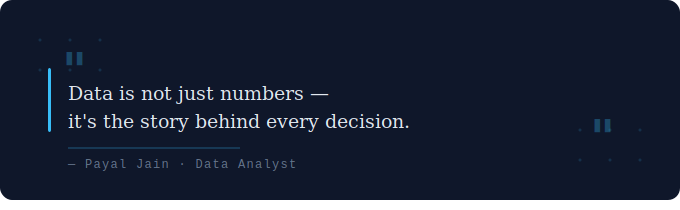

  

# Hi, I'm Payal Jain 👋

**Data Analyst · MCA Student · Building toward Data Science**

*Turning raw data into decisions — one dashboard at a time.*

---

## 👩‍💻 About Me

- 🎯 Targeting Data Analyst roles — with a long-term goal of becoming a Data Scientist
- 🔍 I work on end-to-end data projects: cleaning → analysis → visualization → insights
- 💡 I ask two questions with every dataset: What does the data say? What decision should be made from it?
- 🌱 Currently expanding into advanced SQL, storytelling with data & predictive analytics
- 📍 Delhi, India

---

## 🛠️ Tech Stack

#### Languages & Databases

#### Data Analysis

#### BI & Visualization

#### Tools

---

## 📂 Featured Projects

### 🩺 [AI-Generated-Content-Detection-System](https://github.com/Payaljain05/AI-Generated-Content-Detection-System)
> **Python · PyTorch · EfficientNetB0 · RoBERTa · HuggingFace · Streamlit**

Capstone project - dual-modality detection system classifying AI vs human-generated text (90% accuracy) and images (96% benchmark) using ensemble deep learning techniques.

---

### 📊 [Business-Intelligence-Dashboard-Excel](https://github.com/Payaljain05/Business-Intelligence-Dashboard-Excel)
> **Excel · Power Pivot · Advanced Pivot Tables · Slicers**

Interactive dashboard analyzing £21.4M revenue across 8 countries, 6 products & 5 business segments (2020–2021). Built with dynamic slicers, KPI scorecards & budget variance analysis.

---

### 🩺 [Blood_Cancer_Classification](https://github.com/Payaljain05/Blood_Cancer_Classification)
> **PyTorch · ResNet18 · Scikit-learn · Gradio · Hugging Face**

ResNet18 deep learning model detecting Acute Lymphoblastic Leukemia (ALL) from blood cell images with 72.2% cancer recall — deployed on Hugging Face Spaces via Gradio.

---

### 📈 [Revenue-Analytics-PowerBI](https://github.com/Payaljain05/Revenue-Analytics-PowerBI)
> **Power BI · DAX · Data Modeling**

End-to-end relational data model delivering executive-level KPIs on revenue concentration, profitability & regional performance with drill-down visuals.

---

### 🛒 [E-Commerce-Insights-SQL](https://github.com/Payaljain05/E-Commerce-Insights-SQL)
> **SQL · Microsoft Excel**

End-to-end sales analysis using SQL for data extraction and Excel for dashboard visualization — covering revenue trends, category performance & customer patterns.

---

📩 **Let's Connect**

*Open to Data Analyst roles & internships — let's connect!*

